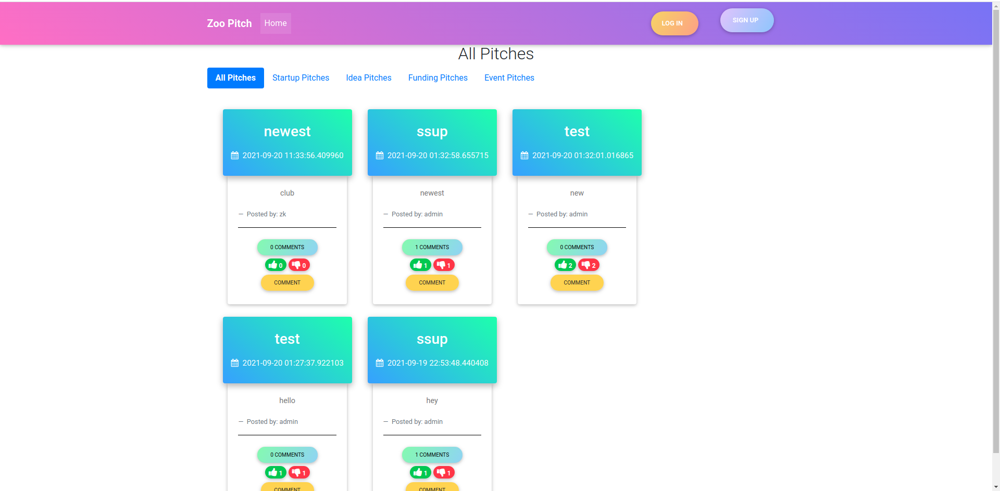

# zoo_pitch
A flask application that allows users to use that one minute wisely. The users will submit their one-minute pitches and other users will vote on them and leave comments to give their feedback on them.

[](https://www.python.org/)


This is a flask application that will help create short pitches as well have people comment on their pitches.

### User Story
Here are some user stories to help you get started:

1. As a user, I would like to see the pitches other people have posted.
2. As a user, I would like to vote on the pitch they liked and give it a downvote or upvote.
3. As a user, I would like to be signed in for me to leave a comment
4. As a user, I would like to receive a welcoming email once I sign up.
5. As a user, I would like to view the pitches I have created in my profile page.
6. As a user, I would like to comment on the different pitches and leave feedback.
7. As a user, I would like to submit a pitch in any category.
8. As a user, I would like to view the different categories.

## Project Objectives
* In your models, implement at least 1 one-to-many relationship.:heavy_check_mark:
* Your project should have a comment model.:heavy_check_mark:
* Your project should have a profile page.:heavy_check_mark:
* Your project must have a user model.:heavy_check_mark:
* Your project should follow the proper folder structure.:heavy_check_mark:
* Your project should have a functioning authentication system.:heavy_check_mark:
* Your project should contain migration files for the different model structure.:heavy_check_mark:


## Showcase



## Live Site

[link to deployed site](https://zoo-pitch.herokuapp.com/ )

## Setup Instructions / Installation

### Getting Started

### Prerequisites

- Python and pip (I am currently using 3.9.6) Any version above 3.7 should work.
* Git installed on your machine
* Code editor/ IDE

### Installation and Running the App

1. Clone GitHub repository

    ```shell
    git clone https://github.com/KenMwaura1/zoo_pitch
    ```

2. Change into the folder

    ```shell
   cd zoo_pitch
    ```

3. Create a virtual environment

   ```shell
      python3 -m venv venv 
   ```

    * Activate the virtual environment
    
   ```shell
   source ./bin/activate
   ```

* If you are using [pyenv](https://github.com/pyenv/pyenv): 

  3a. Create a virtualenv

   ```
       pyenv virtualenv zoo_pitch
   ```

  3b. Activate the virtualenv

   ```
   pyenv activate zoo_pitch
   ```

4. Create a `.env` file and add your credentials

   ```
   touch .env 
   ```

   OR Copy the included example

    ```
    cp .env-example .env 
    ```

5. Add your credentials to the `.env` file


6. Install the required dependencies

   ```shell
   pip install -r requirements.txt
   ```

7. Export `manage.py` as the default flask app in your environment
    ```shell
    export FLASK_APP=manage.py 
    ```
8. Make the shell script executable

    ```shell
   chmod a+x ./start.sh
    ```

9. Run the app

    ```shell
   ./start.sh
    ```

   OR
   run with the [flask-cli](https://flask.palletsprojects.com/en/2.0.x/cli/)

    ```shell
   flask run
    ```

## Tests

* To run the tests:

    ```shell
  flask tests
    ```

## Technologies used

* Python-3.9.6
* Flask web framework
* Bootstrap(Material Bootstrap 4)
* HTML5
* CSS3

## Author

[Ken Mwaura](https://github.com/KenMwaura1)

## LICENSE

MIT License

Copyright (c) 2021 Kennedy Ngugi Mwaura

Permission is hereby granted, free of charge, to any person obtaining a copy
of this software and associated documentation files (the "Software"), to deal
in the Software without restriction, including without limitation the rights
to use, copy, modify, merge, publish, distribute, sublicense, and/or sell
copies of the Software, and to permit persons to whom the Software is
furnished to do so.
